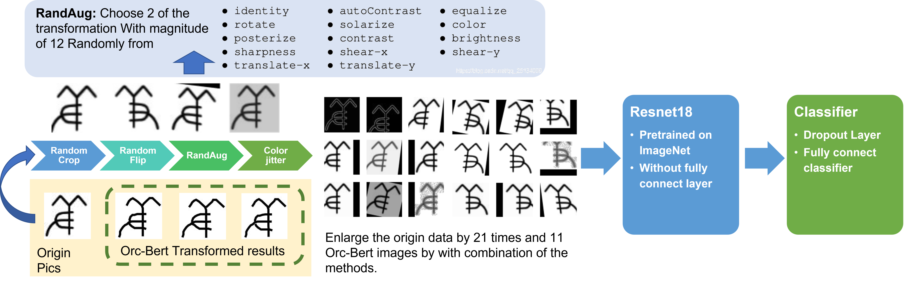
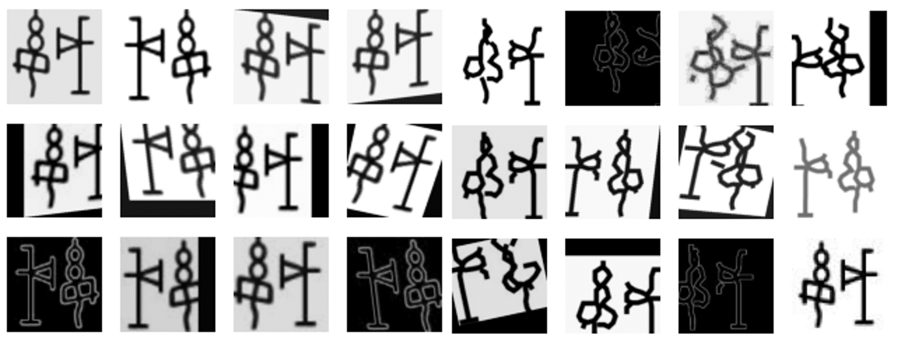

# Few-Shot-Oracle-Character-Recognition
Fudan NNDL Final Project





## 文件组织形式

```
├── data 
│   ├── dataset_masked.py 
│   ├── dataset.py 
│   ├── getclass.py 
│   ├── loading.py 
│   ├── Generate_oracle_fs 
│   ├── Oracle-50K 
│   ├── oracle_fs 
│   └── oracle_source 
├── experiments 
│   ├── Arcface_loss.py 
│   ├── best_result.py 
│   ├── cutmix_result.py 
│   ├── loss_functions.py 
│   └── masked_results.py 
├── load.py 
├── masked_results.py 
├── output 
│   ├── augmentation.png
│   └── process.jpg 
├── README.md 
└── train.py
```

请按此结构存放数据集

## 运行

先运行`data/getclass.py`将每个字对应类别

然后再根目录下面运行`load.py`得到预处理的数据文件（先要运行Bert， 记得解压`data/Generate_oracle_fs.tar.gz`）

再运行`train.py`. 可以通过以下参数更改`shot`.

```bash
python train.py --shot=1
```

## 代码文件概述

`train.py`: ArcLoss版本，但是这个版本效果较差

`train_origin.py`: 最初最基本的版本，效果最好

`loss_functions.py`: 没用的loss function系列

`load.py`: 保存load之后的数据文件，先跑这个再跑 `train_origin.py`可以节省时间

`data/`: `dataset.py`: 最好的 dataloader

`data/`: `dataset_black.py`: 一个黑白照片的尝试，但是结果欠佳

`data/`: `dataset_masked.py`: 用了Bert之后的数据loader文件。

`data/`: `loading.py`: 用于加载数据文件的接口

`data/`: `FFD.py`: 没用的FFD变换

## 主要观点

* **ImageNet 初始化有普遍的提升效果**
* **数据扩增使得小样本训练结果更佳**
* 传统方法更优，Bert对于数据分布改善不如传统方法有效，可能需要从象形文字本身出发叙述原因
* Dropout 有一定的提升效果；Arcloss\归一化特征方法，对于此任务效果不佳
